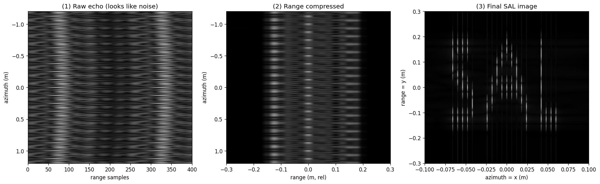
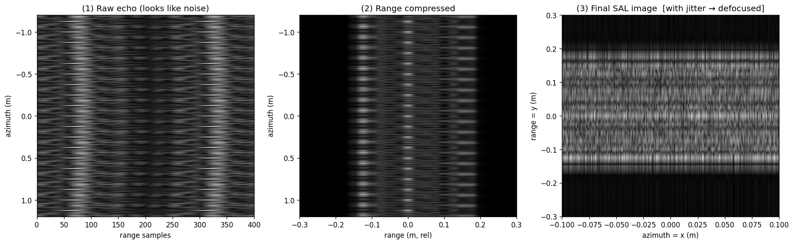

# SAL Imaging Tutorial

从零实现的合成孔径激光雷达（Synthetic Aperture Ladar, SAL）二维成像原理教学仿真。

一个 Python 文件跑通完整成像链路：**正演采集 → 距离向压缩（FFT）→ 方位向压缩（后向投影）→ 取模出图**，并直观演示微米级平台抖动如何摧毁成像。

> ⚠️ **这是教学玩具，不是工程基准。** 为看清原理牺牲了效率与保真度：逐像素后向投影、忽略距离徙动与多普勒调频率、点目标近似、参数非真实系统标定。适合理解原理，不可作为精度基准或工程参考。

## 背景

SAL 是把微波 SAR 的"运动合成大孔径"思想搬到激光波段（波长 ~1.5 μm）。一次脉冲照亮一整片二维地面，所有目标信息叠加在回波里；成像就是用两把不同的"尺子"把信息在两个方向上分别解开：

| 维度 | 分辨率公式 | 物理量 |
|------|-----------|--------|
| 距离向 | δr = c / (2B) | 回波时延——由扫频带宽 B 决定 |
| 方位向 | δa = λR / (2L) | 相位历程——由平台运动积累的合成孔径长度 L 决定 |

全程数据是复数，**相位是合成孔径的信息载体**。这也正是 SAL 的难点：波长仅 ~1.5 μm，微米级的平台抖动、大气扰动或激光相位噪声就足以破坏相干累加、使图像散焦——"运动补偿"与"相位噪声抑制"因此成为该领域的核心研究方向。

## 安装与运行

```bash
pip install -r requirements.txt
python3 sal_imaging.py
```

运行后打印系统分辨率并生成两张三联图（原始回波 / 距离压缩 / 最终图像）。

## 代码结构

`sal_imaging.py` 中每个函数对应成像流程中的一步：

| 函数 | 职责 |
|------|------|
| `SALConfig` | 系统与场景参数，含分辨率公式 |
| `forward()` | 正演：由地面目标生成原始回波矩阵（支持注入抖动） |
| `range_compress()` | 距离向压缩：每行 FFT + Hamming 窗 |
| `backprojection()` | 方位向后向投影成像——合成孔径真正发生的地方 |
| `image_scene()` | 一键跑完整条成像链 |
| `letters_SAL()` | 生成字母 "SAL" 图案作为测试目标 |
| `demo()` | 画三联图（原始 / 距离压缩 / 最终图像） |

## 示例结果

**无干扰成像**——字母 "SAL" 清晰聚焦：



**注入 0.3 μm 随机航迹抖动**——仅波长量级五分之一的误差就使图像完全散焦，直观展示 SAL 对相位误差的极端敏感性：



## 后续方向

- 距离徙动校正（Range Cell Migration Correction）
- RD / CS 等快速成像算法（替代逐像素 BP）
- 自聚焦 / 运动补偿（如 PGA）
- 连续散斑面目标（替代点目标近似）
- 加窗与旁瓣抑制的系统性研究

## License

[MIT](LICENSE)
